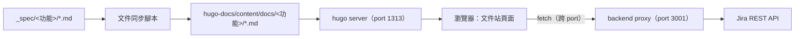

# 系統設計文件 — 網頁 UI 改用文件站樣式呈現

## 主管摘要

**做什麼、為何做**：把現有陽春的 React 單頁網頁整個換掉，改用 Hugo + `hugo-book` 主題呈現規格文件，並在文件站裡嵌入一個輕量的進度儀表板頁面，顯示各功能對應的 Jira 進度。跟 `awtw-short-url-service` 的做法一致，視覺風格統一、有清楚的導覽結構。

**預期效益**：文件更好讀、有目錄與搜尋，看得出功能分類；不用再維護一套 React 前端，改用現成的文件站方案，降低長期維護成本。

**成本／時程估算**：Hugo + hugo-book 是已驗證過的現成方案（`awtw-short-url-service-agent/hugo-docs` 已在用），主要工作是把 `_spec/` 文件同步進 Hugo 的 `content/docs/`、再加一個自訂的進度儀表板頁面，預估 2～3 小時可完成。

**主要風險**：
1. 拿掉 React frontend 後，原本寫好的元件測試（`DocumentViewer.test.jsx`／`ProgressDashboard.test.jsx`／`App.test.jsx`）全部要刪除，這部分投入的心力作廢
2. Hugo 跑在獨立 port（1313），要跟 backend proxy（3001）分開服務、靠瀏覽器跨 port 呼叫（CORS）溝通

**需要決策的事項**：無（React frontend 去留、服務協調方式已由使用者確認）

---

## 技術架構



React frontend（`frontend/`）整個移除，不再維護；backend proxy（`backend/`）維持不變，繼續服務既有的 4 個端點。

## 模組拆解

| 模組 | 職責 | 備註 |
|---|---|---|
| Hugo 文件站 | `hugo.toml` 設定 `theme = "hugo-book"`，渲染文件、左側選單、搜尋、目錄 | 沿用 `awtw-short-url-service-agent/hugo-docs` 的設定方式 |
| 文件同步腳本 | 把 `_spec/<功能>/*.md` 複製到 `hugo-docs/content/docs/<功能>/*.md`，並補上 Hugo 需要的 front matter（`title`、`weight`） | 每次 `/addyosmani-saspec` 產出新文件後執行 |
| 進度儀表板頁面 | Hugo 自訂 layout 頁面，內嵌 Alpine.js，`fetch` backend API 顯示摘要條與票號表格 | 沿用既有 mockup 畫面設計 |
| backend proxy | 不變，繼續提供 `GET /api/features`、`GET /api/documents/:feature`、`GET /api/features/:feature/issues`、`GET /api/jira/issue/:key` | 不新增 API |

## 資料模型

沿用 backend 既有的回應格式，不新增資料結構：

```typescript
// GET /api/features/:feature/issues
interface IssuesResponse {
  created: number
  issues: { key: string; url: string }[]
}

// GET /api/jira/issue/:key
interface IssueDetail {
  key: string
  summary: string
  status: string
}
```

## API 契約

不新增端點，沿用 backend 既有的 4 個端點（見 `_spec/sa-doc-jira-ticketing/design.md` API 契約章節）。

## 技術決策

| 決策 | 選用理由 | 備選方案 | 取捨 |
|---|---|---|---|
| 用 hugo-book 而非自建 React 排版 | 已有短網址專案驗證過的成熟方案，不用自己刻 CSS／排版邏輯，兩個專案視覺一致 | 繼續用 React 手刻排版 | 拿掉 React 的元件化開發方式，改成 Hugo content + 少量 JS |
| 進度儀表板用 Alpine.js，不用 React | 輕量、無 build 步驟，適合嵌入靜態頁面的小工具（抓資料、渲染列表） | 保留 React 只做這個頁面 | 沒有 React 生態的豐富工具鏈，但這個範圍的功能不需要 |
| Hugo 與 backend 分開 port，靠 CORS 溝通 | 跟短網址專案 `hugo-docs` 模式一致，本機開發不用另外做 reverse proxy | 幫 Hugo 加一層 reverse proxy 統一 port | 本機開發要同時啟動兩個服務（`hugo server` + `npm start`） |

## 已知風險與對策

| 風險 | 對策 |
|---|---|
| 移除 React frontend 後，既有元件測試全部作廢 | 直接刪除 `frontend/` 整個目錄與其測試，不強行搬移；新方案（Hugo + Alpine.js）沒有等價的單元測試框架，改用瀏覽器手動驗收 QA 表格取代 |
| `_spec/` 文件與 Hugo `content/docs/` 沒有自動同步機制，容易忘記手動同步 | 寫一支簡單的同步腳本（`sync-docs.js` 或 shell script），`/addyosmani-build` 實作時一併完成，未來也可以考慮掛進 `/addyosmani-saspec` 完成提示的下一步清單 |
