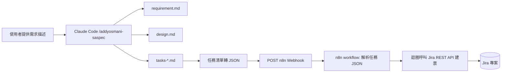

# 系統設計文件 — SA 文件產出與 Jira 自動開票工具

## 主管摘要

**做什麼、為何做**：建立一套自動化工具，把 SA 手動撰寫需求文件、系統設計文件、開發任務清單、再手動搬運到 Jira 開票的流程全部自動化。SA 只要提供一份需求描述，工具就能產出三份文件並直接在 Jira 建立對應的票，不用人工複製貼上。

**預期效益**：省下 SA 重複撰寫規格文件與逐筆開票的時間，降低任務漏標、角色分派錯誤的風險。

**時程估算**：核心流程（文件產出 + Jira 自動建票）預估 1～2 個工作天可完成 PoC 規模的驗證；獨立網頁前端（Should，下一階段）另外估時，不影響本階段時程。

**主要風險**：
1. n8n／Jira 的 API 憑證屬敏感資訊，需要在開始前先設定好（見下方 Phase 0），避免中途卡住
2. 產出文件的準確度依賴 AI 對需求描述的理解，需保留人工確認關卡（已內建於 `/addyosmani-saspec` 流程）

**需要決策的事項**：無（沿用現有 n8n 環境與 Jira 帳號，比照 `awtw-short-url-service` 專案的既有設定）

---

## 技術架構



核心流程不經 Notion 中介（與 `awtw-short-url-service` 的「Notion Status 變更觸發 n8n」模式不同），改為文件確認後直接呼叫 n8n Webhook，減少一道人工搬運步驟。

## 模組拆解

| 模組 | 職責 | 負責角色 |
|---|---|---|
| 文件產出模組 | 執行 `/addyosmani-saspec`，依序產出 requirement.md／design.md／tasks-*.md | AI（Claude Code） |
| 任務轉換模組 | 把 tasks-*.md 中的任務表格轉換成 JSON，POST 到 n8n Webhook | AI（Claude Code，對話中直接呼叫） |
| n8n 建票 workflow | 接收 Webhook → 解析 JSON → 逐筆呼叫 Jira REST API 建票 → 回傳結果 | Backend |
| 獨立網頁（Frontend Phase 2） | 文件檢視器、進度儀表板 UI（純查詢，不含需求輸入，見 `_note/decisions.md`） | Frontend |
| Jira 查詢 proxy（Frontend Phase 2） | 前端與 Jira REST API 之間的輕量後端，持有 Jira credential，前端不直接接觸憑證，只服務「讀取票狀態」 | Backend |

## 資料模型

**任務 JSON（送往 n8n 的格式）**：
```typescript
interface TaskPayload {
  project: string;        // 例如 "sa-doc-jira-ticketing"
  tasks: {
    role: "frontend" | "backend" | "qa" | "devops";
    title: string;
    executorType: "AI" | "manual";  // 對應 🤖 / 👤
    phase: string;
    tdd: string;           // 測試命名，格式：應該_<預期行為>_當<條件>
  }[];
}
```

## API 契約

**n8n Webhook**
```
POST /webhook/sa-jira-ticketing
Content-Type: application/json

Request body: TaskPayload（如上）

Response 200:
{
  "created": number,
  "issues": [{ "key": string, "url": string }]
}

Response 400:
{ "error": string }  // 例如缺少必要欄位、role 不在允許清單內
```

**n8n workflow 內部呼叫 Jira REST API**
```
POST https://<site>.atlassian.net/rest/api/3/issue
Authorization: Basic <email>:<api-token>

fields:
  project.key: "ASJ"
  summary: <task.title>
  issuetype.name: "Task"
  labels: [task.role, task.executorType]
```

## 技術決策

| 決策 | 選用理由 | 備選方案 | 取捨 |
|---|---|---|---|
| 用 n8n 而非直接寫程式呼叫 Jira API | 延續 `awtw-short-url-service` 已驗證過的工具鏈，不用重新學一套串接方式 | 直接用 Node.js/Python 寫一支腳本呼叫 Jira REST API | 多一層 n8n workflow 要維護，但換取與既有環境一致 |
| Webhook 觸發，不經 Notion 中介 | 減少「複製開票格式貼到 Notion → 改 Status → n8n 才觸發」這道人工搬運步驟 | 沿用短網址專案的 Notion 觸發模式 | 少了 Notion 作為人工複核的緩衝點，需要在 AI 呼叫 Webhook 前確保任務清單已經過使用者確認（已內建於 saspec 流程） |

## 已知風險與對策

| 風險 | 對策 |
|---|---|
| n8n Webhook URL、Jira API Token 外洩 | 存放於 n8n credential，不寫入程式碼或 markdown 文件；比照短網址專案「`.env` 從未被 git 追蹤」的作法 |
| AI 理解需求有誤，產出文件不準確 | 每個階段（requirement／design／tasks）產出後都要使用者確認才進入下一步 |
| Jira 建票失敗（專案代碼錯誤、必填欄位缺漏） | n8n workflow 需回傳明確錯誤訊息，不可 silent fail；失敗時不建立部分票，整批回滾或明確標示哪幾筆失敗 |

---

## Phase 0 — 環境門檻（全部 👤，開發前一次設定完）

以下屬於人工設定，建議在開始 Phase 1 之前一次盤點完成，避免開發中途才發現卡住：

- 建立 Jira 專案（或沿用既有 `ASUS` 專案）
- 取得 Jira API Token，設定進 n8n credential
- 建立 n8n Webhook node，取得 Webhook URL
