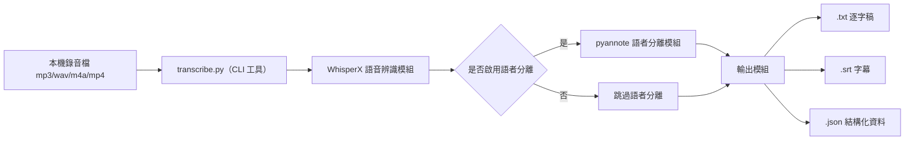

# 系統設計文件 — 會議錄音本機轉逐字稿

## 主管摘要

**做什麼、為何做**：用開源的 WhisperX 模型在本機電腦執行語音辨識與語者分離，把會議錄音轉成逐字稿，不需要任何雲端服務或訂閱費用，錄音內容不外流。

**預期效益**：省下人工聽打會議記錄的時間，且完全在本機處理，符合會議內容敏感性的要求，沒有額外的雲端 API 費用。

**成本／時程估算**：核心工具（WhisperX）是現成開源套件，主要成本是首次環境安裝設定（Python、PyTorch，若要語者分離還要申請 Hugging Face token），預估 1 小時內可完成設定；沒有後續開發成本。

**主要風險**：
1. 沒有 GPU（或 VRAM 不足 8GB）的電腦上，`large-v3` 模型處理速度會很慢，語者分離尤其明顯
2. 語者分離需要每個使用者自行申請 Hugging Face token、並到兩個模型頁面同意使用條款，是一個一次性的手動門檻，漏做會出現 401 錯誤

**需要決策的事項**：若目標使用者的電腦沒有 GPU，需要決定是接受較慢的處理速度，還是改用較小的模型（`small`／`medium`）換取速度。

---

## 技術架構



全程在本機執行，沒有任何步驟需要把音檔上傳到外部伺服器。

## 模組拆解

| 模組 | 職責 | 備註 |
|---|---|---|
| 語音辨識模組 | 用 Whisper（`large-v3` 或更小模型）把語音轉成文字，含時間戳對齊 | 由 WhisperX 封裝提供 |
| 語者分離模組 | 用 pyannote 模型判斷每段話是誰說的（`SPEAKER_00` 等標籤） | 需要 Hugging Face token，可用 `--no-diarize` 跳過 |
| 輸出模組 | 依語音辨識與語者分離結果，產出三種格式檔案 | 純文字、字幕、結構化 JSON |

## 資料模型

**JSON 輸出結構**（供後續串接其他工具，例如接 Claude API 做摘要）：

```typescript
interface TranscriptSegment {
  start: number       // 開始時間（秒）
  end: number          // 結束時間（秒）
  text: string         // 這段話的文字內容
  speaker?: string     // 語者標籤（例如 "SPEAKER_00"），未啟用語者分離時可能沒有這個欄位
}

interface TranscriptOutput {
  segments: TranscriptSegment[]
}
```

## CLI 參數契約

本工具是本機命令列工具，不是網路服務，用 CLI 參數取代 API 契約：

```
python transcribe.py --input <檔案或資料夾> --output-dir <輸出目錄>
  [--hf-token <token>]           # 啟用語者分離時需要
  [--no-diarize]                 # 跳過語者分離，不需要 token
  [--model <tiny|base|small|medium|large-v3>]  # 預設 large-v3
  [--language <語言碼|auto>]      # 預設 zh
  [--device <cuda|cpu>]           # 預設自動偵測
  [--batch-size <n>]              # GPU 記憶體不足時可調小，預設 16
  [--min-speakers <n>] [--max-speakers <n>]  # 已知會議人數範圍時可加，提高語者分離準確度
```

每個音檔在 `--output-dir` 產生 `{檔名}.txt`／`{檔名}.srt`／`{檔名}.json` 三個檔案。

## 技術決策

| 決策 | 選用理由 | 備選方案 | 取捨 |
|---|---|---|---|
| 用 WhisperX 而非原生 OpenAI Whisper | WhisperX 額外提供詞級時間戳對齊與語者分離整合，原生 Whisper 沒有這些功能，要自己拼接其他工具 | 原生 Whisper + 自行整合對齊/分離工具 | 多依賴一個套件，但省下大量整合工作 |
| 語者分離用 pyannote | 目前是 WhisperX 官方整合的方案，準確度與整合度較好 | 其他開源語者分離模型 | 需要使用者額外申請 Hugging Face token、同意兩個模型的使用條款，是一個手動門檻 |
| 全程本機執行，不上雲 | 符合 `requirement.md` 範圍邊界（會議內容敏感、不上傳） | 用雲端語音辨識 API（如 Whisper API、Google Speech-to-Text） | 使用者要自己準備硬體（尤其是 GPU），沒有 GPU 時處理速度較慢 |

## 已知風險與對策

| 風險 | 對策 |
|---|---|
| CPU-only 環境下 `large-v3` 模型處理很慢 | 建議先用 `--model small` 或 `--model medium` 測試，`--device` 也可明確指定 `cpu` |
| Hugging Face token 申請與條款同意是常見卡關點（兩個模型頁面都要同意，漏一個會出現 401） | 屬於一次性的手動設定門檻，只要設定一次即可；不需要語者分離的情境可直接加 `--no-diarize` 完全跳過這個門檻 |
